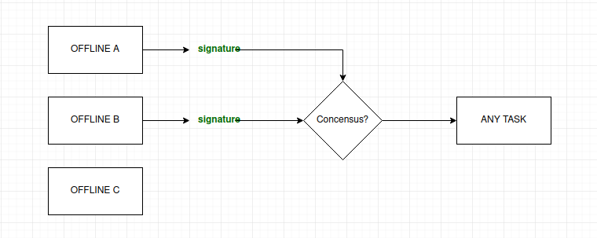

# XDC Offline Multi-Sig

Aim of this repository to create multi-sig transfer where the signing party is assumed to be on an offline machine. A signed message is generated using the private key of an acccount.

The application consists of a smart contract, an offline system which will generate a signed message, and an interface to broadcast a signature to the contract.



## Verification Of Signature

This repository uses the latest method of web3/xdc3 ```web3.eth.accounts.sign()``` to sign has of inputs + nonce. 
Every TX is identified by its unique hash. In case of a conflicting hashes submitted by different owners, the hash with the majority will be considered and be processed.
The smart contract will verify the owner of the signature and recover the signer's address. If it matches any of the owner then it will be considered valid.
Once majority confirmations are reached on a particular message hash, it will be processed automatically. 

As per the latest security standards its not considered secure to use non-prefixed messages for signing purposes and hence ```web3.eth.accounts.sign()``` adds a prefix by default to your message hash. This little part need to be considered while regenerating the hash in the smart contract when recovering the signer address. You can checkout ```prefixHash()``` functionality in the smart contract [here](./contracts/MultiSig.sol).  